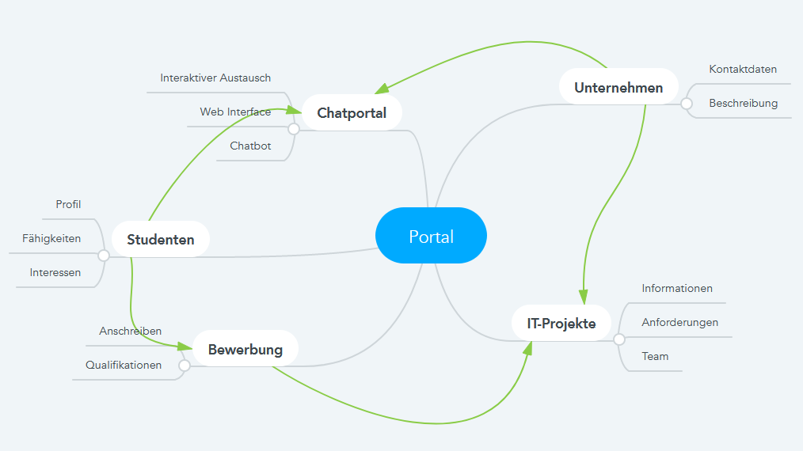

# SE-Übung 4
von Laurenz Dilba (9037743) und Ron Autenrieb (9037538)

## Aufgabe 1
### a) Mindmap

### b) Userstorys
1. Student loggt sich im Portal ein
    + Aufwandsschätzung: 13
    + Mehrwertschätzung: 8
    + Akzeptanzkriterien
        + Userlogin ist Sicher
        + Logindaten können gespeichert werden
        
2. Student schaut sich verfügbare IT-Projekte
    + Aufwandsschätzung: 8
    + Mehrwertschätzung: 13
    + Akzeptanzkriterien
        + Design ist übersichtlich und verständlich
        + Alle Informationen sind vorhanden
        
3. Student kontaktiert Firma und gibt Projekt bei der Kontaktanfrage an
    + Aufwandsschätzung: 3
    + Mehrwertschätzung: 8
    + Akzeptanzkriterien
        + Firma wird über Kontaktanfrage benachrichtigt
        + Angegebenes Projekt wird Firma übermittelt
        
4. Student chattet mit Firma über Chatportal
    + Aufwandsschätzung: 13
    + Mehrwertschätzung: 5
    + Akzeptanzkriterien
        + Chat funktioniert in Echtzeit
        + Text, Bilder, Link und Dokumente können gesendet werden
        
5. Unternehmen legt IT-Projekt an
    + Aufwandsschätzung: 8
    + Mehrwertschätzung: 13
    + Akzeptanzkriterien
        + Projekt kann von Studenten gefunden werden
        + IT-Projekt kann im nachhinein bearbeitet werden
        + Designmöglichkeiten reichen für Firmen aus
        
6. Unternehmen entfernt abgelaufenes IT-Projekt
    + Aufwandsschätzung: 1
    + Mehrwertschätzung: 3
    + Akzeptanzkriterien
        + Projekt wird nicht mehr in der Suche angezeigt
        + Projekt bleibt gespeichert und kann später reaktiviert werden
        
7. Student löscht sein Konto
    + Aufwandsschätzung: 1
    + Mehrwertschätzung: 1
    + Akzeptanzkriterien
        + Kontodaten sind aus der Datenbank entfernt
        + Alle Bewerbungen des Studenten werden zurückgezogen
        
8. Student zieht seine Bewerbung zurück
    + Aufwandsschätzung: 2
    + Mehrwertschätzung: 3
    + Akzeptanzkriterien
        + Firma wird über Bewerbungsrückzug benachrichtigt
        + Bewerbung wird nicht mehr angezeigt

## Test Suite

### Tests
TestCase No. | Category | Äquivalenzklasse | Input | Output
--- | --- | --- | --- | --- |
 |  |  |  | 

### Zugehörige Äquivalenzklassen
Parameter | Äquivalenzklasse | Repräsentant
--- | --- | ---
 |  | 
